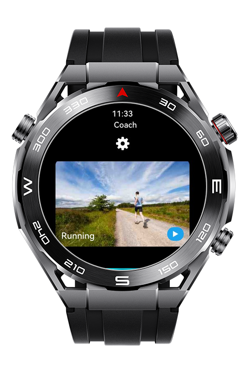
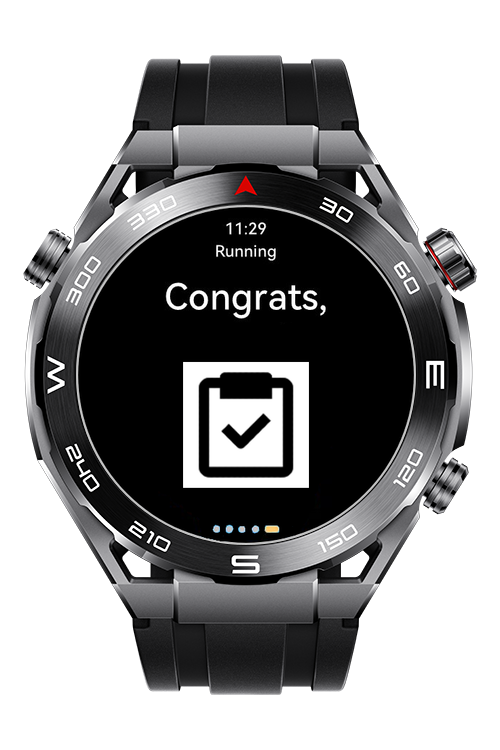
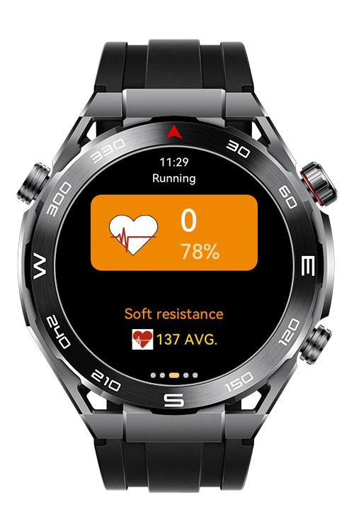

> **Note:** To access all shared projects, get information about environment setup, and view other guides, please visit [Explore-In-HMOS-Wearable Index](https://github.com/Explore-In-HMOS-Wearable/hmos-index).

# Moveo

Fundamentals for Wear engine feature that receiving data to lite device from mobile 

> **Companion app:** This is the Lite Wearable watch side of Moveo. The Android phone app it pairs with is [moveo-mobile](https://github.com/Explore-In-HMOS-Wearable/moveo-mobile). Install both to try the full flow.

# Preview

<div>
  
  
  
</div>

# Use Cases
- Send ping to awake wearable device and app itself
- Send health data to wearable

# Tech Stack
- **Languages**: HML, JS
- **Frameworks**: 5.0.0(12)
- **Tools**: DevEco Studio Version 6.0.0
- **Libraries**: @system.wearengine, @ohos.router

# Directory Structure

```
entry/
├── src/main/js/MainAbility/
│ ├── app.js
│ ├── common/
│ │ ├── constants.js
│ │ ├── cycling.jpg
│ │ ├── final-page-image.png
│ │ ├── home-page-settings-icon.png
│ │ ├── running.jpg
│ │ ├── second-page-white-heart.png
│ │ ├── second-page-yellow-heart.png
│ │ ├── settings-icon.png
│ │ ├── swimming.jpg
│ │ ├── third-page-image.png
│ │ ├── walking.jpg
│ │ └── yoga.jpg
│ │
│ ├── pages/
│ │ └── index/
│ │     ├── index.css
│ │     ├── index.hml
│ │     └── index.js
│ │
│ ├── utils/
│ │ └── time.js
│ │
│ └── wearengine/
│   └── wearengine.js
```

# Constraints and Restrictions

## Supported Devices

* Huawei Watch GT 5
* Huawei Sport (Lite) Watch GT 4/5/6
* Huawei Sport (Lite) GT4/5 Pro
* Huawei Sport (Lite) Fit 3/4
* Huawei Sport (Lite) D2
* Huawei Sport (Lite) Ultimate
* DevEco Studio Simulator

## Pre-Requirement
 
This app needs Mooveora Android App to work with wear engine feature.
 
* Connect lite wearable device to mobile phone
* Login Huawei Health Kit on mobile side
* While on workout session send health data and can be displayed data on lite wearable device 

# License (MIT)

Moveo is distributed under the terms of the MIT License. See the [LICENSE](./LICENSE) for more information.